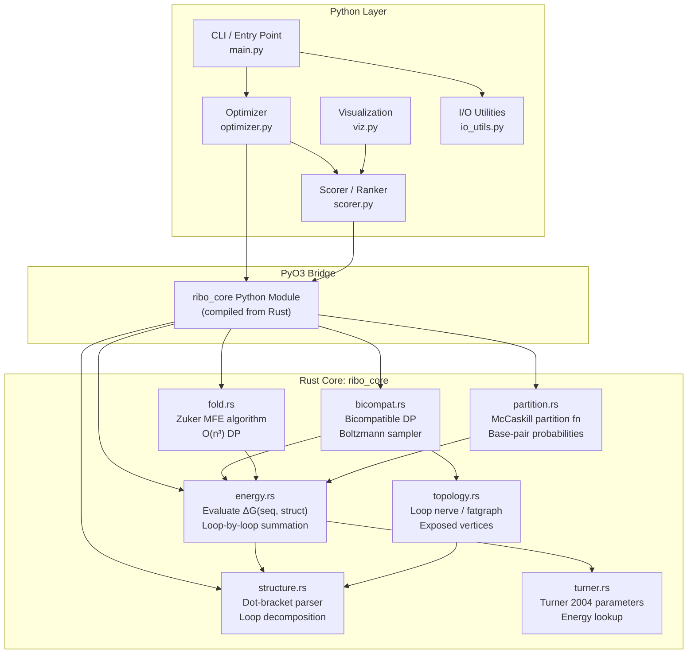

# RNA Riboswitch Inverse Design — Full Architecture

## Goal

Build a from-scratch system that, given two RNA secondary structures in dot-bracket notation (ON-state, OFF-state), outputs ranked RNA sequences predicted to function as riboswitches. The quality criterion comes from Huang, Barrett & Reidys (2021): both structures should rank close to MFE for the designed sequence.

---

## Academic Integrity: Relationship to Existing Work

> [!CAUTION]
> **The Bifold software (Huang et al., GitHub: FenixHuang667/Bifold) is a reference only.** You may study its source code to understand the recurrence structure, DP traversal order, and how the partition function tables are organized. You do **NOT** copy, translate, or adapt any of its C code. Your implementation is written entirely from scratch, in a different language, with your own data structures and code organization. You cite the paper (Huang, Barrett & Reidys, 2021) as the theoretical foundation. This is standard academic practice — reproducing a published algorithm from its paper description.

What you may learn from reading Bifold's source:
- How the loop nerve traversal order is computed in practice
- How exposed vertices are tracked during the DP
- Edge cases in the partition function calculation (numerical stability, overflow handling)

What you write yourself:
- All type definitions, parsing, energy evaluation, DP logic, sampling, and scoring
- All tests and validation infrastructure
- The optimizer/refinement pipeline (not present in Bifold at all)

---

## Language Strategy: Python-First, then Rust

The development follows a **Python-first** workflow. Every module is first implemented and validated in Python, where debugging RNA energy calculations is dramatically easier (print intermediate values, use debuggers, compare against known results interactively). Once a module is proven correct, the performance-critical path is ported to Rust and exposed back to Python via PyO3.

| Phase | Language | Purpose |
|---|---|---|
| **Prototype & validate** (Phases 1–5) | **Python** | Get every algorithm correct. Debug energy rules against NNDB. Verify MFE against web servers. Test bicompatible sampler on known riboswitches. |
| **Performance port** (Phase 6) | **Rust + PyO3** | Port `energy.py`, `fold.py`, `bicompat.py` to Rust. Keep Python API identical. Speed up ~50-100×. |
| **Orchestration & thesis** (Phases 7–8) | **Python** | Optimizer, scorer, CLI, visualization stay in Python permanently. |

> [!TIP]
> **Why Python first?** A single mistyped Turner parameter (there are thousands) will produce subtly wrong energies. In Python you can `print()` every loop contribution and compare line-by-line against the NNDB examples. In Rust you'd be fighting the borrow checker AND debugging thermodynamics simultaneously. Get the science right first, then get the speed.

> [!NOTE]
> **Rust port is optional for thesis submission.** If time runs short, a pure-Python implementation is perfectly valid for a bachelor thesis. The architecture is designed so the Rust port is a drop-in replacement — same function signatures, same tests — that can happen after the defense if desired.

---

## High-Level Architecture



---

## Detailed Module Design

### Phase 1: Core Data Structures

All code examples below show the **Python prototype** version. The Rust equivalents (shown in comments where relevant) will have identical semantics.

---

#### `ribo_switch/types.py` — Fundamental types (Python prototype)

> The Rust port equivalent: `ribo_core/src/types.rs`

```python
from enum import IntEnum
from dataclasses import dataclass, field
from typing import Optional

class Base(IntEnum):
    A = 0; C = 1; G = 2; U = 3

class BasePair(IntEnum):
    AU = 0; UA = 1; CG = 2; GC = 3; GU = 4; UG = 5  # canonical + wobble

CANONICAL_PAIRS: set[tuple[Base, Base]] = {
    (Base.A, Base.U), (Base.U, Base.A),
    (Base.C, Base.G), (Base.G, Base.C),
    (Base.G, Base.U), (Base.U, Base.G),
}

# Energy in units of 0.01 kcal/mol (int arithmetic avoids float drift)
Energy = int  # type alias

def energy_to_kcal(e: Energy) -> float:
    return e / 100.0

@dataclass
class Sequence:
    bases: list[Base]
    def __len__(self): return len(self.bases)
    def __str__(self): return ''.join(b.name for b in self.bases)

@dataclass
class Structure:
    length: int
    pair_table: list[int]          # pair_table[i] = j if paired, else -1
    pairs: list[tuple[int, int]]   # (i, j) with i < j

@dataclass
class HairpinLoop:
    closing_pair: tuple[int, int]
    unpaired: list[int]

@dataclass
class StackLoop:
    outer_pair: tuple[int, int]
    inner_pair: tuple[int, int]

@dataclass
class InteriorLoop:
    outer_pair: tuple[int, int]
    inner_pair: tuple[int, int]
    left_unpaired: list[int]
    right_unpaired: list[int]

@dataclass
class BulgeLoop:
    outer_pair: tuple[int, int]
    inner_pair: tuple[int, int]
    unpaired: list[int]
    side: str  # "left" or "right"

@dataclass
class MultiLoop:
    closing_pair: tuple[int, int]
    branches: list[tuple[int, int]]
    unpaired: list[int]

@dataclass
class ExternalLoop:
    unpaired: list[int]
    closing_pairs: list[tuple[int, int]]

# Union type for any loop
LoopType = HairpinLoop | StackLoop | InteriorLoop | BulgeLoop | MultiLoop | ExternalLoop
```

> [!NOTE]
> Using `i32` in units of 0.01 kcal/mol is the standard convention in ViennaRNA and RNAstructure. It avoids floating-point accumulation errors during DP. All Turner parameters are stored this way.

---

### Phase 2: Structure Parser

---

#### `ribo_switch/structure.py`  (Python prototype)

> Rust port equivalent: `ribo_core/src/structure.rs`

**Responsibilities:**
1. Parse dot-bracket string `"(((...)))"` → `Structure`
2. Validate: balanced parentheses, no pseudoknots (unless extended later)
3. Decompose into loops — walk the structure and identify every loop region

**Key functions:**
```python
def parse_dot_bracket(db: str) -> Structure:
    """Parse dot-bracket notation into a Structure."""

def decompose_loops(structure: Structure) -> list[LoopType]:
    """Decompose a structure into its constituent loops.
    Uses a stack-based algorithm: traverse left-to-right, push opening parens,
    when closing paren found, identify the enclosed loop type."""

def classify_loop(structure: Structure, i: int, j: int) -> LoopType:
    """Identify if a pair (i,j) closes a hairpin, interior, bulge, multi, or stack."""
```

**Algorithm for loop decomposition:**
1. For each closing base pair `(i, j)`, find all enclosed base pairs at depth +1
2. Zero enclosed pairs → hairpin
3. One enclosed pair `(p, q)`:
   - `p == i+1 and q == j-1` → stacking pair
   - One side has no unpaired → bulge
   - Both sides have unpaired → interior loop
4. Two or more enclosed pairs → multiloop
5. Pairs not enclosed by anything → external loop

---

### Phase 3: Turner 2004 Energy Model

---

#### `ribo_switch/turner.py` — Parameter Storage (Python prototype)

> Rust port equivalent: `ribo_core/src/turner.rs`

**Data to hardcode** (from [NNDB Turner 2004](https://rna.urmc.rochester.edu/NNDB/)):

| Parameter Table | Dimensions | Description |
|---|---|---|
| `STACK_ENERGIES` | 6 × 6 (pair × pair) | Stacking of two adjacent base pairs |
| `HAIRPIN_INIT` | 30 entries | Initiation ΔG by loop size (1–30+) |
| `HAIRPIN_TRI_TETRA` | ~400 entries | Special hairpin triloop/tetraloop bonuses |
| `HAIRPIN_MISMATCH` | 6 × 4 × 4 | Terminal mismatch in hairpins |
| `INTERIOR_INIT` | 30 entries | Initiation ΔG by total unpaired count |
| `INTERIOR_1x1` | 6 × 6 × 4 × 4 | 1×1 internal loop special cases |
| `INTERIOR_1x2` | 6 × 6 × 4 × 4 × 4 | 1×2 internal loop special cases |
| `INTERIOR_2x2` | 6 × 6 × 4 × 4 × 4 × 4 | 2×2 internal loop special cases |
| `INTERIOR_MISMATCH` | 6 × 4 × 4 | Terminal mismatch for larger interior loops |
| `BULGE_INIT` | 30 entries | Bulge initiation by size |
| `MULTI_PARAMS` | 3 values | `a` (offset) + `b` (per-pair) + `c` (per-unpaired) |
| `DANGLE_5` / `DANGLE_3` | 6 × 4 | Dangling end contributions |
| `TERMINAL_AU_PENALTY` | 1 value | Penalty for terminal AU/GU pairs |
| `NINIO_MAX` / `NINIO_M` | 2 values | Asymmetry correction for interior loops |
| `ML_MISMATCH` | 6 × 4 × 4 | Terminal mismatch for multiloops |
| `LOOP_EXTRAPOLATION` | 1 value | Jacobson-Stockmayer coefficient for large loops |

```python
import numpy as np
from dataclasses import dataclass, field

@dataclass
class TurnerParams:
    stack: np.ndarray              # shape (6, 6), int32, units 0.01 kcal/mol
    hairpin_init: np.ndarray       # shape (31,)
    hairpin_triloop: dict[str, int]   # 5-mer string → energy
    hairpin_tetraloop: dict[str, int] # 6-mer string → energy
    hairpin_mismatch: np.ndarray   # shape (6, 4, 4)
    interior_init: np.ndarray      # shape (31,)
    interior_1x1: np.ndarray       # shape (6, 6, 4, 4)
    interior_1x2: np.ndarray       # shape (6, 6, 4, 4, 4)
    interior_2x2: np.ndarray       # shape (6, 6, 4, 4, 4, 4)
    interior_mismatch: np.ndarray  # shape (6, 4, 4)
    bulge_init: np.ndarray         # shape (31,)
    ml_offset: int = 0
    ml_per_branch: int = 0
    ml_per_unpaired: int = 0
    ml_mismatch: np.ndarray = field(default_factory=lambda: np.zeros((6,4,4), dtype=np.int32))
    dangle5: np.ndarray = field(default_factory=lambda: np.zeros((6,4), dtype=np.int32))
    dangle3: np.ndarray = field(default_factory=lambda: np.zeros((6,4), dtype=np.int32))
    terminal_au_penalty: int = 50  # 0.5 kcal/mol
    ninio_max: int = 300
    ninio_m: int = 60
    loop_extrapolation_coeff: float = 1.079  # Jacobson-Stockmayer

    @staticmethod
    def turner2004() -> 'TurnerParams':
        """Return hardcoded Turner 2004 parameters from NNDB."""
        ...
```

> [!TIP]
> Source all values from the [NNDB download page](https://rna.urmc.rochester.edu/NNDB/download.html). The `.dat` files are also available in the ViennaRNA and RNAstructure GitHub repos as plain-text tables you can transcribe. Using numpy arrays in Python makes the later Rust port straightforward — the array shapes map directly to Rust fixed-size arrays.

---

#### `ribo_switch/energy.py` — Energy Evaluation (Python prototype)

> Rust port equivalent: `ribo_core/src/energy.rs`

**Core function:** Given a sequence and a structure, compute ΔG.

```python
def eval_energy(seq: Sequence, structure: Structure, params: TurnerParams) -> Energy:
    """Compute total free energy of seq folded into struct."""

# Energy contributions for each loop type
def hairpin_energy(seq: Sequence, closing: tuple[int,int], params: TurnerParams) -> Energy: ...
def stack_energy(seq: Sequence, outer: tuple[int,int], inner: tuple[int,int],
                params: TurnerParams) -> Energy: ...
def interior_energy(seq: Sequence, outer: tuple[int,int], inner: tuple[int,int],
                   left_unp: int, right_unp: int, params: TurnerParams) -> Energy: ...
def bulge_energy(seq: Sequence, outer: tuple[int,int], inner: tuple[int,int],
                unp_count: int, params: TurnerParams) -> Energy: ...
def multiloop_energy(seq: Sequence, closing: tuple[int,int],
                    branches: list[tuple[int,int]], unpaired: int,
                    params: TurnerParams) -> Energy: ...
def external_energy(seq: Sequence, structure: Structure,
                   params: TurnerParams) -> Energy: ...
```

**Hairpin energy rules** (most complex single loop type):
1. `size < 3` → impossible (return +∞)
2. Look up `hairpin_init[size]` (or extrapolate for size > 30)
3. If size == 3: check triloop table, add terminal AU penalty
4. If size == 4: check tetraloop table
5. Add terminal mismatch: `hairpin_mismatch[closing_pair][seq[i+1]][seq[j-1]]`
6. Special case: all-C loop penalty

**Interior loop energy rules:**
1. `(n1, n2)` = unpaired on each side
2. If `n1 == 1 && n2 == 1`: use `interior_1x1` table
3. If `(n1,n2) == (1,2)` or `(2,1)`: use `interior_1x2` table
4. If `n1 == 2 && n2 == 2`: use `interior_2x2` table
5. Else: `interior_init[n1+n2]` + asymmetry penalty `min(ninio_max, ninio_m * |n1-n2|)` + terminal mismatches on both sides

---

### Phase 4: MFE Folding (Zuker Algorithm)

---

#### `ribo_switch/fold.py` (Python prototype)

> Rust port equivalent: `ribo_core/src/fold.rs`

This is the classic O(n³) dynamic programming for MFE, implementing the Zuker (1981) recursion. **This is essential** for the optimizer — it needs to know, for a candidate sequence, whether the ON/OFF structures actually rank near MFE.

**DP tables:**
```python
@dataclass
class FoldResult:
    v: np.ndarray          # V[i][j] = min energy assuming (i,j) paired, shape (n, n)
    w: np.ndarray          # W[i][j] = min energy of subsequence i..j, shape (n, n)
    mfe_structure: str     # MFE structure in dot-bracket
    mfe_energy: Energy     # MFE energy in 0.01 kcal/mol

def fold_mfe(seq: Sequence, params: TurnerParams) -> FoldResult: ...
```

**Recursion (Zuker style):**

For `V[i][j]` (assuming base pair `(i,j)`):
```
V[i][j] = min {
    hairpin_energy(i, j),
    min over (p,q) with i<p<q<j: {
        if stack:    stack_energy(i,j,p,q) + V[p][q]
        if interior: interior_energy(i,j,p,q) + V[p][q]
        if bulge:    bulge_energy(i,j,p,q) + V[p][q]
    },
    multiloop_energy(i, j, ...)
}
```

For `W[i][j]` (optimal of any subsequence):
```
W[i][j] = min {
    W[i+1][j],           // i is unpaired
    W[i][j-1],           // j is unpaired
    V[i][j],             // (i,j) form a pair
    min over i<k<j: W[i][k] + W[k+1][j]   // bifurcation
}
```

**Traceback** reconstructs the optimal structure from the DP tables.

---

### Phase 5: Bicompatible Sequence Sampler (Huang & Reidys Core)

This is the most novel and complex module — the heart of the thesis.

---

#### `ribo_switch/topology.py` — Structure Pair Topology (Python prototype)

> Rust port equivalent: `ribo_core/src/topology.rs`

**Purpose:** Given two structures S₁ and S₂ of the same length, compute:
1. The **loop decomposition** of each structure
2. The **loop nerve** — a simplicial complex where loops are vertices, and loops sharing nucleotide positions are connected
3. **Exposed vertices** (κ) — nucleotides that appear in loops from both structures simultaneously. These are the positions where the DP must "remember" nucleotide assignments.

```python
@dataclass
class StructurePairTopology:
    structure1: Structure
    structure2: Structure
    loops1: list[LoopType]
    loops2: list[LoopType]
    exposed_positions: list[bool]   # exposed_positions[i] = True if in loops of both
    kappa: int                      # max exposed vertices in any DP subproblem
    dp_order: list['DPNode']        # traversal order

@dataclass
class DPNode:
    kind: str                       # "loop1", "loop2", or "joint"
    loop1_indices: list[int] = field(default_factory=list)
    loop2_indices: list[int] = field(default_factory=list)
    exposed: list[int] = field(default_factory=list)

def analyze_topology(s1: Structure, s2: Structure) -> StructurePairTopology: ...
```

> [!WARNING]
> **Complexity guard:** The Bifold implementation itself stops if κ > 20 because the DP complexity is O(4^κ × n) — it explodes exponentially. Your implementation should include this check and warn the user.

---

#### `ribo_switch/bicompat.py` — Boltzmann Sampler (Python prototype)

> Rust port equivalent: `ribo_core/src/bicompat.rs`

**Purpose:** Given two structures S₁ and S₂, sample RNA sequences from the Boltzmann distribution that are compatible with both structures.

**Algorithm overview (from the paper — reimplemented from the mathematical description, NOT from Bifold source code):**

1. **Compatibility constraint:** At every paired position `(i,j)` in S₁, `seq[i]` and `seq[j]` must form a valid base pair. Same for S₂. A position paired in both structures imposes intersection constraints.

2. **Partition function DP:**  
   - Traverse the DP order computed by `topology.py`
   - For loops that belong to only one structure: sum Boltzmann weights `exp(-ΔG/RT)` over all allowed nucleotide assignments
   - For joint regions: enumerate all 4^κ assignments of exposed vertices, for each assignment compute the combined Boltzmann weight from both structures' energy contributions
   - Build partition function tables bottom-up

3. **Stochastic traceback:**  
   - Sample nucleotide assignments top-down, proportional to Boltzmann weights
   - For exposed vertices: sample proportional to joint weight
   - For non-exposed positions: sample given the constraints from already-assigned neighbors

```python
class BicompatSampler:
    def __init__(self, s1: str, s2: str, params: TurnerParams,
                 temperature: float = 37.0):  # °C
        self.topology = analyze_topology(
            parse_dot_bracket(s1), parse_dot_bracket(s2)
        )
        self.params = params
        self.rt = 0.001987204 * (temperature + 273.15)  # R*T in kcal/mol
        self._tables: dict | None = None

    def precompute(self) -> None:
        """Compute partition function tables (expensive, call once)."""
        ...

    def sample(self, n: int) -> list[Sequence]:
        """Sample N sequences from the Boltzmann distribution."""
        ...

    def partition_function(self) -> float:
        """Return the partition function value Z (for diagnostics)."""
        ...
```

---

### Phase 6: Python Layer

---

#### `python/ribo_switch/io_utils.py`

```python
def read_structure_pair(filepath: str) -> tuple[str, str]:
    """Read two dot-bracket structures from a FASTA-like file."""

def write_results(results: list[CandidateResult], filepath: str, fmt: str = "tsv"):
    """Write ranked results to file."""

@dataclass
class CandidateResult:
    sequence: str
    energy_s1: float      # ΔG(seq, S1) in kcal/mol
    energy_s2: float      # ΔG(seq, S2) in kcal/mol
    mfe_energy: float     # MFE energy of seq
    rank_s1: int          # rank of S1 among all suboptimal structures
    rank_s2: int          # rank of S2 among all suboptimal structures
    combined_score: float # optimizer objective
```

---

#### `python/ribo_switch/scorer.py`

**The Huang & Reidys quality criterion:**

> A good riboswitch candidate has both S₁ and S₂ ranking **close to MFE** for the designed sequence. Native riboswitches typically have both structures within the top 5–10 ranked structures.

```python
def score_candidate(seq: str, s1: str, s2: str) -> CandidateResult:
    """
    1. Compute E1 = eval_energy(seq, s1)
    2. Compute E2 = eval_energy(seq, s2)
    3. Compute MFE = fold_mfe(seq).mfe_energy
    4. Compute rank_s1 = number of structures with energy ≤ E1
    5. Compute rank_s2 = number of structures with energy ≤ E2
    6. combined_score = E1 + E2 + α * (rank_s1 + rank_s2) + β * |E1 - E2|
    """
```

> [!NOTE]
> Computing exact ranks requires suboptimal structure enumeration (Wuchty algorithm), which is additional complexity. A simpler **initial approximation**: use `(E1 - MFE) + (E2 - MFE)` as a proxy. This measures how far each target structure is from optimal.

---

#### `python/ribo_switch/optimizer.py`

**Purpose:** Search sequence space for high-scoring riboswitch candidates.

**Strategy (multi-stage):**

```python
class RiboswitchOptimizer:
    def __init__(self, s1: str, s2: str, config: OptimizerConfig):
        self.sampler = BicompatSampler(s1, s2)
        
    def run(self) -> list[CandidateResult]:
        # Stage 1: Boltzmann sampling (Huang-Reidys)
        # Generate N initial candidates from bicompatible sampler
        candidates = self.sampler.sample(n=1000)
        
        # Stage 2: Score and filter
        scored = [score_candidate(seq, self.s1, self.s2) for seq in candidates]
        top_k = sorted(scored, key=lambda c: c.combined_score)[:100]
        
        # Stage 3: Local search / mutation refinement
        refined = self.local_search(top_k)
        
        # Stage 4: Final ranking
        return sorted(refined, key=lambda c: c.combined_score)
    
    def local_search(self, seeds: list[CandidateResult]) -> list[CandidateResult]:
        """
        For each seed sequence:
        1. Try single-point mutations at each position
        2. Constraint: mutation must maintain bicompatibility
        3. Accept if score improves (greedy) or with probability (simulated annealing)
        """
```

---

#### `python/ribo_switch/main.py` — CLI Entry Point

```python
@click.command()
@click.argument('structure1')
@click.argument('structure2')
@click.option('--samples', default=1000, help='Number of Boltzmann samples')
@click.option('--top-k', default=20, help='Number of top candidates to report')
@click.option('--output', default='results.tsv')
@click.option('--temperature', default=37.0, help='Temperature in Celsius')
def design(structure1, structure2, samples, top_k, output, temperature):
    """Design riboswitch sequences for two target structures."""
```

---

## Project Directory Structure

```
ribo-switch-design/
├── pyproject.toml                # Python project config
├── ribo_switch/                  # Python package (prototype → stays as orchestration layer)
│   ├── __init__.py
│   ├── types.py                  # Base, Sequence, Structure, LoopType, Energy
│   ├── structure.py              # Dot-bracket parser, loop decomposition
│   ├── turner.py                 # Turner 2004 parameter tables (numpy arrays)
│   ├── energy.py                 # Energy evaluation (seq + struct → ΔG)
│   ├── fold.py                   # Zuker MFE folding algorithm
│   ├── partition.py              # McCaskill partition function (optional)
│   ├── topology.py               # Loop nerve, exposed vertices, DP ordering
│   ├── bicompat.py               # Bicompatible Boltzmann sampler
│   ├── scorer.py                 # Candidate scoring (Huang & Reidys criterion)
│   ├── optimizer.py              # Multi-stage optimization
│   ├── main.py                   # CLI entry point
│   ├── io_utils.py               # File I/O
│   └── viz.py                    # Result visualization (optional)
├── ribo_core/                    # Rust crate — LATER port (compiled to Python module via PyO3)
│   ├── Cargo.toml
│   └── src/
│       ├── lib.rs                # PyO3 module definition
│       ├── types.rs
│       ├── structure.rs
│       ├── turner.rs
│       ├── energy.rs
│       ├── fold.rs
│       ├── partition.rs
│       ├── topology.rs
│       └── bicompat.rs
├── tests/
│   ├── test_structure.py         # Unit tests for each module
│   ├── test_energy.py
│   ├── test_fold.py
│   ├── test_bicompat.py
│   ├── test_known_riboswitches.py  # ★ Biological validation tests
│   └── test_end_to_end.py
├── data/
│   └── known_riboswitches/       # Ground-truth validation data
│       ├── add_adenine.json      # Adenine riboswitch (add A-riboswitch)
│       ├── thi_tpp.json          # TPP riboswitch (thiamine pyrophosphate)
│       └── README.md             # Data sources and citations
├── Cargo.toml                    # Rust workspace root (created when porting)
└── thesis.pdf
```

---

## Implementation Order — Python First

### Phase 0: Project Scaffolding
- [ ] Initialize git repository
- [ ] Create `ribo_switch/` package with `__init__.py`
- [ ] Create `tests/` folder with `conftest.py` and pytest configured
- [ ] Write one dummy test that passes (`test_smoke.py`)
- [ ] Create `pyproject.toml` with project metadata and pytest dependency
- [ ] Verify `pytest` runs green

### Phase 1: Foundation in Python (Week 1–2)
- [ ] `types.py` — All core types
- [ ] `structure.py` — Dot-bracket parser + loop decomposition
- [ ] `tests/test_structure.py` — Parse known structures, verify loop counts
- [ ] Parse the adenine riboswitch ON/OFF structures as first real test

### Phase 2: Energy Model in Python (Week 2–4) ★ Hardest data entry
- [ ] `turner.py` — Transcribe all Turner 2004 tables from NNDB into numpy arrays
- [ ] `energy.py` — Implement all loop energy functions
- [ ] `tests/test_energy.py` — Verify energies against NNDB examples and RNAfold web server
- [ ] **Checkpoint:** `eval_energy(adenine_sequence, adenine_ON_structure)` matches published value ± 0.1 kcal/mol

### Phase 3: MFE Folding in Python (Week 4–5)
- [ ] `fold.py` — Zuker DP algorithm + traceback
- [ ] `tests/test_fold.py` — Fold known sequences, compare MFE to RNAfold web server
- [ ] **Checkpoint:** `fold_mfe(adenine_sequence).mfe_structure` reproduces the known MFE fold

### Phase 4: Bicompatible Sampler in Python (Week 5–7) ★ Core novelty — Full Huang-Reidys DP
- [ ] `topology.py` — Loop nerve construction, exposed vertex detection, κ computation
- [ ] `bicompat.py` — Full Boltzmann sampler with exposed-vertex enumeration, partition function tables
- [ ] `tests/test_bicompat.py` — Sample from adenine + TPP riboswitch structure pairs
- [ ] **Checkpoint:** sampled sequences for adenine riboswitch are bicompatible + have low energy for both structures
- [ ] **Optional extension:** `partition.py` — McCaskill partition function for base-pair probabilities (improves scoring quality, not required for core pipeline)

### Phase 5: Scoring & Optimization in Python (Week 7–8)
- [ ] `scorer.py` — Implement Huang & Reidys quality criterion (MFE-gap based; upgrade to partition-function-based if McCaskill is implemented)
- [ ] `optimizer.py` — Multi-stage pipeline (sample → score → local search → rank)
- [ ] `main.py` — CLI
- [ ] `io_utils.py` — File handling

### Phase 6: Biological Validation (Week 8–9) ★ Thesis results
- [ ] `tests/test_known_riboswitches.py` — Full validation suite against adenine + TPP riboswitches
- [ ] Run pipeline on adenine riboswitch → designed sequences should have native-like energy spectrum
- [ ] Run pipeline on TPP riboswitch → second independent validation point
- [ ] `viz.py` — Plot energy landscapes, rank distributions
- [ ] **Checkpoint:** reproduce the key finding from Huang et al. — designed sequences show the "native signature"

### Phase 7: Rust Port (Week 9+ or post-thesis)
- [ ] Port `energy.py` → `energy.rs` (highest impact: inner loop of scoring)
- [ ] Port `fold.py` → `fold.rs` (second highest: O(n³) DP)
- [ ] Port `bicompat.py` → `bicompat.rs` (third: partition function computation)
- [ ] PyO3 bridge: `lib.rs` exposing same API as Python modules
- [ ] Run **identical test suite** against Rust module — results must match Python to ±0.01 kcal/mol

---

## Decided: Design Decisions (Locked In)

> [!IMPORTANT]
> **Full Huang-Reidys DP.** No simplified fallback. The bicompatible Boltzmann sampler implements the complete algorithm from the paper: loop nerve topology, exposed vertex enumeration (4^κ), partition function DP, and stochastic traceback. This is the core contribution of the thesis.

> [!IMPORTANT]
> **Full Turner 2004 energy model.** Every parameter table from NNDB, every special case (triloops, tetraloops, 1×1/1×2/2×2 internal loops, Jacobson-Stockmayer extrapolation). No shortcuts, no simplified energy functions.

> [!NOTE]
> **McCaskill partition function: deferred.** Listed as optional extension in Phase 4. The scorer uses MFE-gap `(ΔG(seq, S) - MFE(seq))` as the quality criterion. If McCaskill is added later, the scorer upgrades to partition-function-based probabilities.

> [!NOTE]
> **Validation riboswitches: adenine + TPP.** Two independent ground-truth systems, sufficient for a bachelor thesis. Adenine is the primary benchmark (crystal structures, Huang et al. reference). TPP demonstrates generalization.

---

## Biological Validation — Thesis Ground Truth

This is the validation story for the thesis. You must show your algorithm produces biologically meaningful results by testing against **known, experimentally characterized riboswitches** whose sequences and structures are published.

---

### Ground-Truth Riboswitch #1: Adenine Riboswitch (add A-riboswitch)

**Why this one?** Best-characterized riboswitch in the literature. Crystal structures exist for both states. Used as a benchmark in Huang et al.

| Property | Value | Source |
|---|---|---|
| Organism | *Vibrio vulnificus* (or *B. subtilis* pbuE) | Rfam RF00167 |
| Length | ~71 nt (aptamer domain) | PDB: 1Y26 |
| Ligand | Adenine | |
| ON structure (ligand-bound) | `...(((((((...((((((.........))))))........((((((.......))))))...)))))))...` | Rfam / literature |
| OFF structure (ligand-free) | `...(((((((............((((((..........))))))((((((........))))))..)))))))...` | Literature |
| Native sequence | `CGCUUCAUAUAAUCCUAAUGAUAUGGUUUGGGAGUUUCUACCAAGAGCCUUAAACUCUUGAUUAUGAAGUG` | Rfam |

**Acceptance criteria for your algorithm:**
1. `eval_energy(native_seq, ON_struct)` and `eval_energy(native_seq, OFF_struct)` should both be within ~2–5 kcal/mol of MFE energy
2. Your designed sequences should show a similar energy gap pattern
3. The native sequence should score well under your quality criterion (if it doesn't, your criterion needs adjustment)

> [!NOTE]
> You will need to obtain the exact dot-bracket structures from Rfam or the literature. The structures above are approximate — verify against the actual Rfam entry RF00167 and published crystal structure data.

---

### Ground-Truth Riboswitch #2: TPP Riboswitch (Thiamine Pyrophosphate)

**Why this one?** Different mechanism (translation regulation), widely distributed across species, well-studied thermodynamics.

| Property | Value | Source |
|---|---|---|
| Organism | *E. coli* thiM | Rfam RF00059 |
| Length | ~80 nt (aptamer domain) | PDB: 2GDI |
| Ligand | Thiamine pyrophosphate (TPP) | |
| ON structure (ligand-bound) | Complex — obtain from Rfam RF00059 | |
| OFF structure (ligand-free) | Alternative pairing — obtain from literature | |
| Native sequence | Obtain from Rfam RF00059 seed alignment | |

**Acceptance criteria:**
1. Same energy-gap analysis as adenine riboswitch
2. Demonstrates your algorithm generalizes beyond one riboswitch class

---

### Validation Test Suite: `tests/test_known_riboswitches.py`

```python
class TestAdenineRiboswitch:
    """Validate the full pipeline against the adenine riboswitch ground truth."""
    
    def test_native_sequence_is_bicompatible(self):
        """The native add sequence must be compatible with both ON and OFF structures."""
    
    def test_native_energy_near_mfe(self):
        """ΔG(native, ON) and ΔG(native, OFF) should both be close to MFE.
        Acceptance: within 5 kcal/mol of MFE for each structure."""
    
    def test_designed_sequences_bicompatible(self):
        """All sequences output by the sampler must be bicompatible."""
    
    def test_designed_sequences_energy_spectrum(self):
        """Designed sequences should show the 'native signature' from Huang et al.:
        both structures rank within top-10 of the energy landscape.
        At least 10% of designed sequences should meet this criterion."""
    
    def test_energy_spectrum_vs_random(self):
        """Random bicompatible sequences should NOT show the native signature.
        This is the key control experiment from the paper.
        Generate 1000 random bicompatible sequences (uniform, no Boltzmann weighting).
        Their energy gap should be significantly larger than designed sequences."""
    
    def test_designed_vs_native_similarity(self):
        """Designed sequences should have reasonable sequence identity to native.
        Not identical (that would be overfitting), but sharing conserved motifs."""

class TestTPPRiboswitch:
    """Same validation suite for TPP riboswitch — second independent test."""
    # Same test methods as above, different ground-truth data
```

---

### Thesis Figure Plan

These are the minimum figures you need to show biological validation:

1. **Energy spectrum plot (Huang et al. Figure 3 reproduction):** For adenine riboswitch, scatter plot of (rank_S1, rank_S2) for designed sequences (blue) vs. random sequences (gray). Native sequence marked as a red star. Designed sequences should cluster near the origin.

2. **Energy gap histogram:** Distribution of `ΔG(seq, S1) - MFE(seq)` for designed vs. random sequences. Designed should peak near zero.

3. **Score convergence:** How the optimizer's combined score improves with number of samples and local search iterations.

4. **Generalization table:** Summary table showing validation metrics for adenine + TPP.

---

## Verification Plan

### Automated Tests (run with `pytest`)
- **Structure parser:** Parse adenine and TPP riboswitch structures, verify pair counts and loop classification
- **Energy model:** Compare `eval_energy()` output against published values from NNDB examples and RNAfold web server
- **MFE folding:** Fold adenine riboswitch native sequence, compare MFE and structure to RNAfold
- **Bicompatible sampler:** Verify sampled sequences satisfy both structures' base-pair constraints
- **Biological validation:** Full `test_known_riboswitches.py` suite (see above)

### Manual Cross-Validation
- Submit 5 designed sequences to [RNAfold web server](http://rna.tbi.univie.ac.at/cgi-bin/RNAWebSuite/RNAfold.cgi), verify energy values match your implementation
- Compare energy spectrum of designed sequences vs. random sequences — should reproduce the native signature from Huang et al.
- Verify the adenine riboswitch native sequence scores well under your quality criterion
